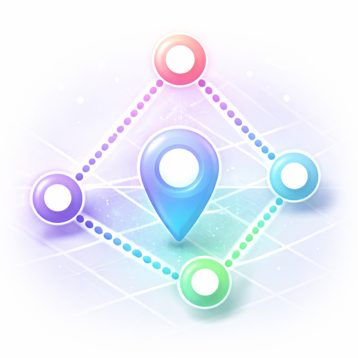

#  Custom Zone

Custom Zone is a Home Assistant custom component that lets you define polygon-based zones and track whether one or more `person` or `device_tracker` entities are inside them. Unlike Home Assistant's built-in circular zones, Custom Zone supports arbitrary shapes defined by latitude/longitude points.

## Features

- **Polygon Zones**: Define custom shapes with 3 to 15 points.
- **Multi-tracker Support**: Monitor up to 10 `person` or `device_tracker` entities in one zone.
- **Interactive Configuration**: Build the polygon point by point through the UI.
- **Dynamic Feedback**: See the point count and current polygon type while you configure the zone.
- **Availability-aware State**: If any selected tracker stops providing usable coordinates, the sensor becomes unavailable instead of reporting a false zone exit.
- **Rich Attributes**: Exposes aggregate counts, unavailable trackers, and per-tracker status details.

## Installation

### HACS

1. Go to **HACS** > **Integrations**.
2. Open the three-dot menu and choose **Custom repositories**.
3. Add the repository URL.
4. Choose **Integration** as the category.
5. Install **Custom Zone**.
6. Restart Home Assistant.

### Manual Installation

1. Copy `custom_components/custom_zone` into your Home Assistant `config/custom_components/` directory.
2. Restart Home Assistant.

## Configuration

Configuration is done entirely through the Home Assistant UI.

1. Go to **Settings** > **Devices & Services**.
2. Click **Add Integration**.
3. Search for **Custom Zone**.
4. Enter a unique zone name.
5. Select one or more `person` or `device_tracker` entities.
6. Add polygon points one at a time:
   - Enter **Latitude** and **Longitude** values.
   - Coordinates are validated to stay within valid geographic ranges.
   - After the second point, the **Finished adding points** checkbox appears so you can complete the polygon once you have at least 3 points.
   - The flow stops automatically after 15 points.

## Usage

After configuration, the integration creates:

- `sensor.customzone_<person>_<zone>` for single-tracker zones
- `sensor.customzone_<zone>` for multi-tracker zones

### State

- **`<count> in zone`**: The number of configured trackers currently inside the polygon.
- **`all out of zone`**: All trackers with usable coordinates are outside the polygon.
- **`unavailable`**: At least one configured tracker has no usable location data.

### Attributes

- `trackers`: The configured entity IDs.
- `polygon`: A list of `[latitude, longitude]` pairs defining the zone.
- `trackers_in_zone`: Trackers confirmed inside the polygon.
- `trackers_out_zone`: Trackers confirmed outside the polygon.
- `trackers_unavailable`: Trackers that are unavailable, missing coordinates, or reporting invalid coordinates.
- `count_in_zone`, `count_out_zone`, `count_unavailable`: Aggregate counts.
- `<slugified_entity_id>_in_zone`, `<slugified_entity_id>_distance`, `<slugified_entity_id>_status`: Per-tracker attributes keyed by the full entity ID, avoiding collisions between `person` and `device_tracker` entities with the same object ID.

### Example Automation

```yaml
automation:
  - alias: "Notify when someone enters custom zone"
    trigger:
      - platform: state
        entity_id: sensor.customzone_driveway
        from: "all out of zone"
        to: "1 in zone"
    action:
      - service: notify.mobile_app_my_phone
        data:
          message: "A tracker has entered the custom zone."
```
