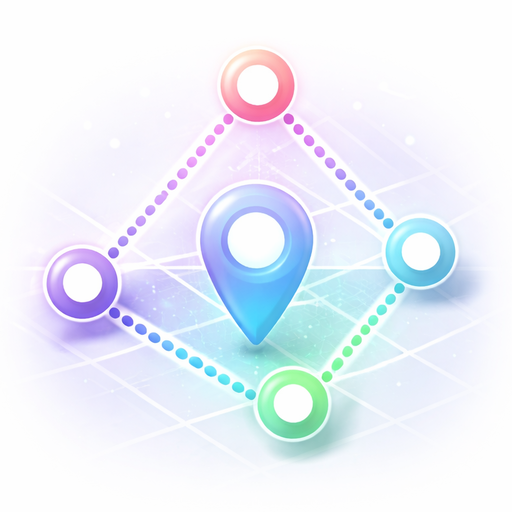

  

# Custom Zone

Custom Zone is a Home Assistant custom integration for polygon-based presence zones.

## What It Does

The integration lets you define a polygon in the Home Assistant UI, attach one or more `person` or `device_tracker` entities to it, and expose an aggregate sensor that reports how many tracked entities are currently inside the zone.

## Core Features

- polygon-based zone definition from the Home Assistant UI
- one or more tracked entities per zone
- aggregate zone sensor output
- options flow for renaming the zone, changing trackers, and editing the polygon
- in-repo geometry rules and tracker-confidence handling

## Installation

### Preferred: HACS

1. Go to **HACS -> Integrations**.
2. Open the three-dot menu and choose **Custom repositories**.
3. Add this repository URL.
4. Choose **Integration** as the category.
5. Install **Custom Zone**.
6. Restart Home Assistant.

### Fallback: Manual

1. Copy `custom_components/custom_zone` into your Home Assistant `config/custom_components/` directory.
2. Restart Home Assistant.

## How To Use It

1. Add the **Custom Zone** integration.
2. Enter a unique zone name.
3. Select one or more `person` or `device_tracker` entities.
4. Add at least three polygon points.
5. Use the created sensor to track how many entities are currently inside the zone.

## Documentation

Start with:

- [docs/product-specs/custom-zone-contract.md](docs/product-specs/custom-zone-contract.md)
- [ARCHITECTURE.md](ARCHITECTURE.md)
- [docs/RELIABILITY.md](docs/RELIABILITY.md)

For repository workflow and agent-focused context, read [AGENTS.md](AGENTS.md).
