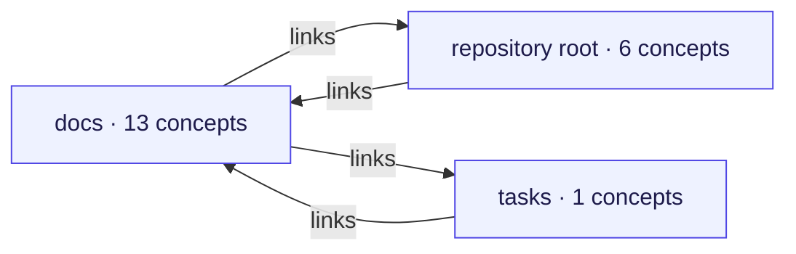
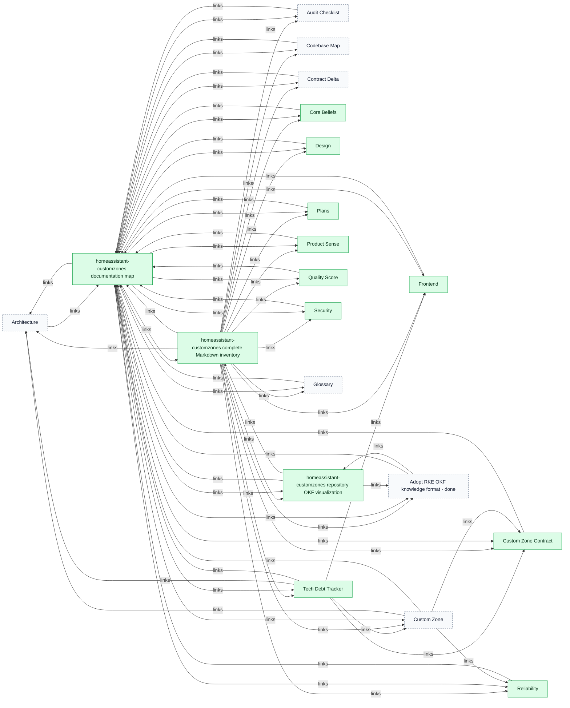
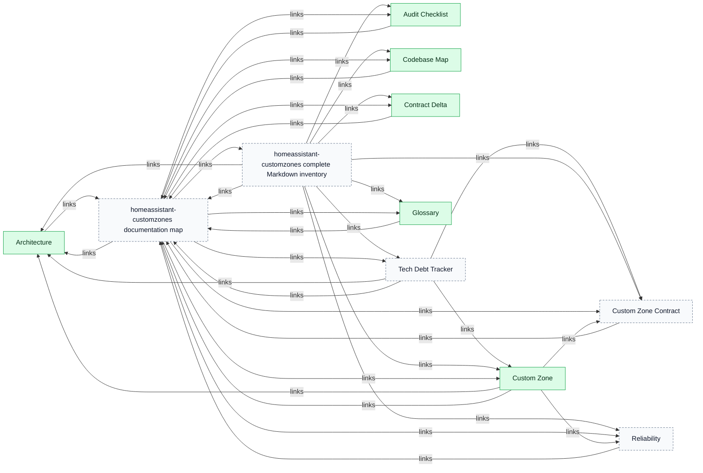
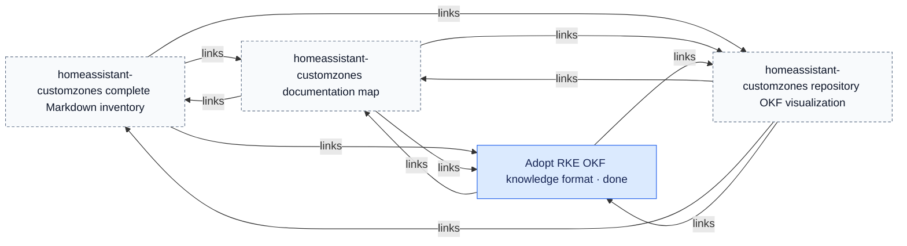
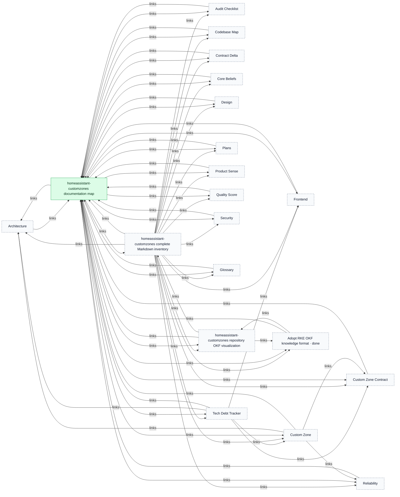
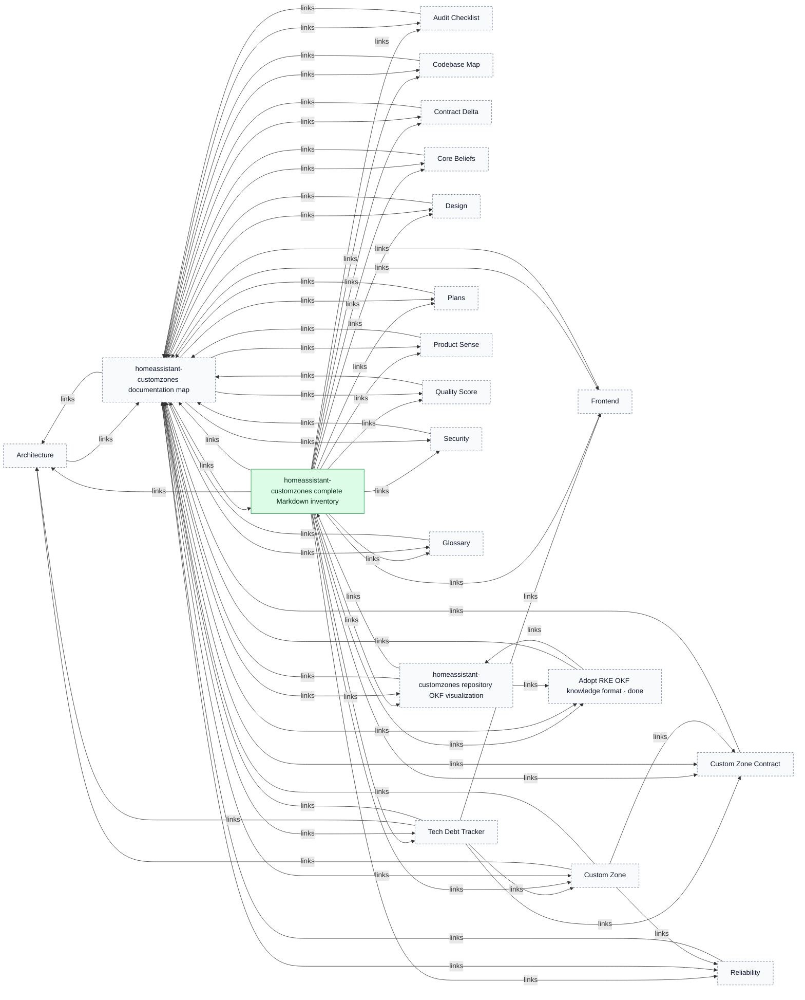
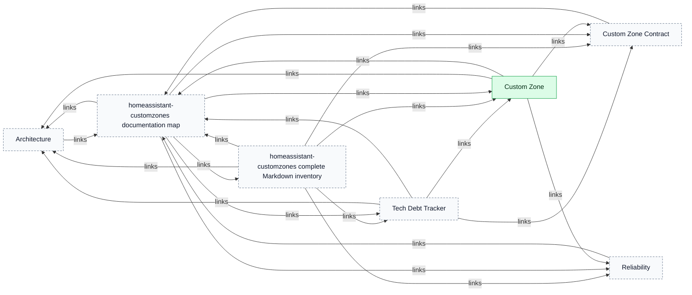
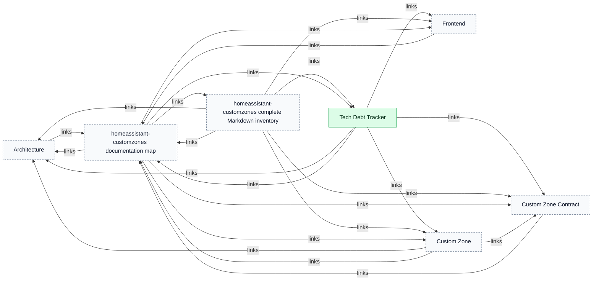
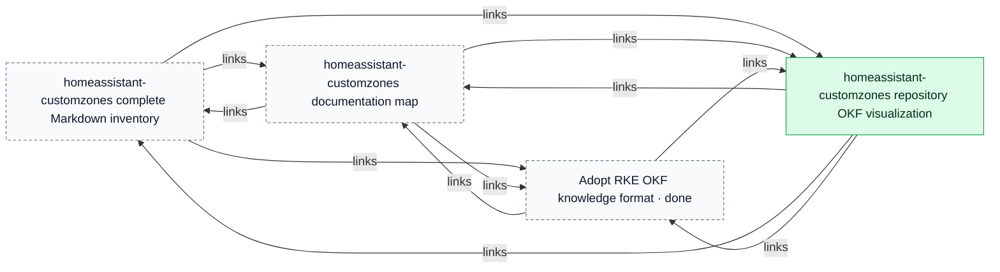
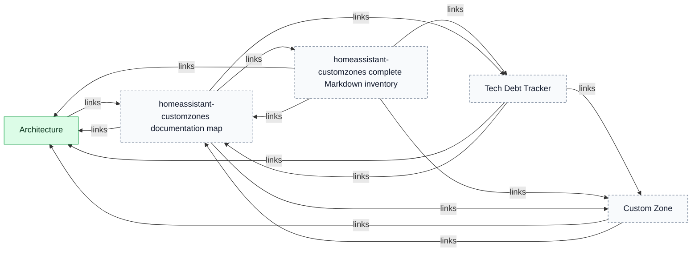

# homeassistant-customzones

> Generated from repository-local OKF records. The Markdown/YAML bundle remains canonical.

Source: `homeassistant-customzones`

The report separates the connected repository map from detailed component and key-concept views so large bundles remain reviewable.

## Connected-area overview

## Connected component 1

### docs

### repository root

### tasks

## Key concept neighbourhoods

### homeassistant-customzones documentation map

### homeassistant-customzones complete Markdown inventory

### Custom Zone

### Tech Debt Tracker

### homeassistant-customzones repository OKF visualization

### Architecture

## Legend

- Blue: task
- Purple: workstream
- Orange: tracker profile
- Green: durable knowledge
- Dashed neutral nodes: neighbouring context repeated from another area or key-concept view
- Time references: edges to addressable `Task.time[]` fragments
- Arrows: structured relationships or repository-local Markdown links
